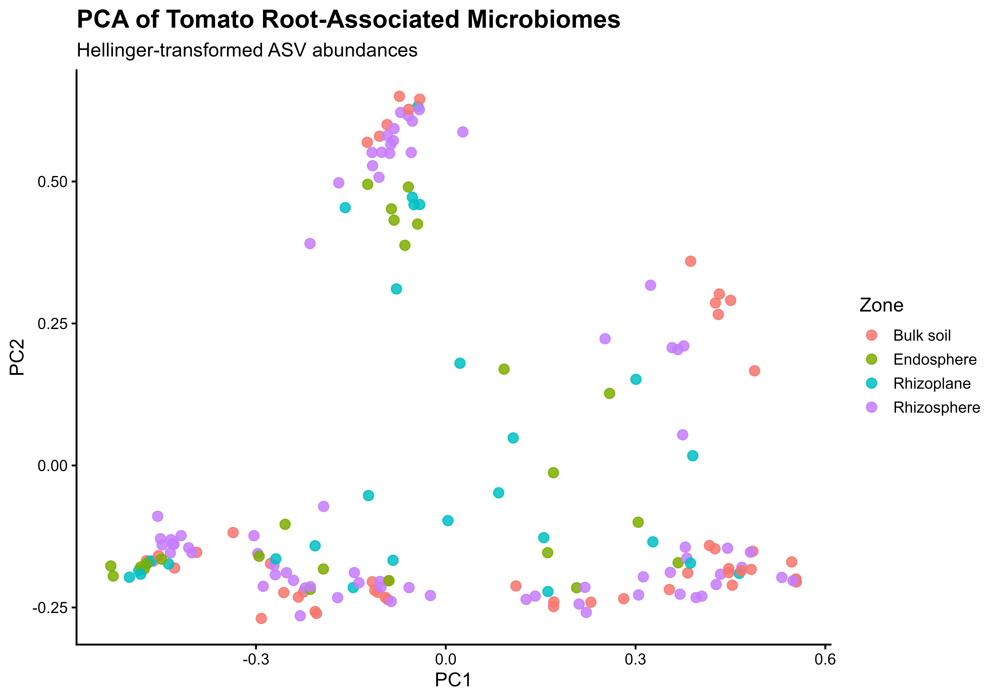
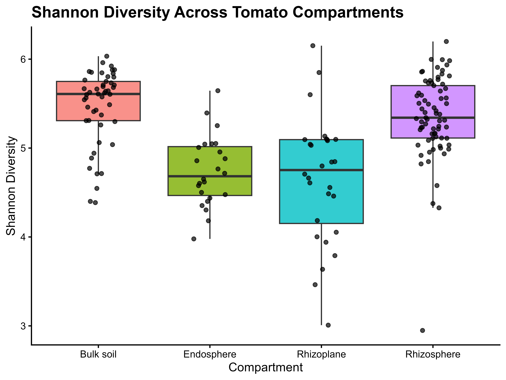
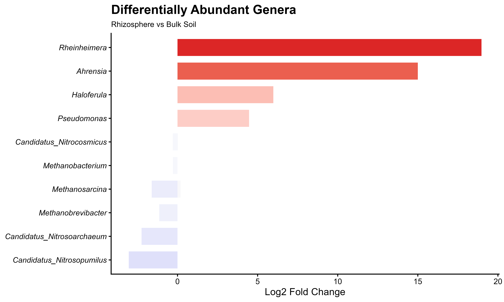
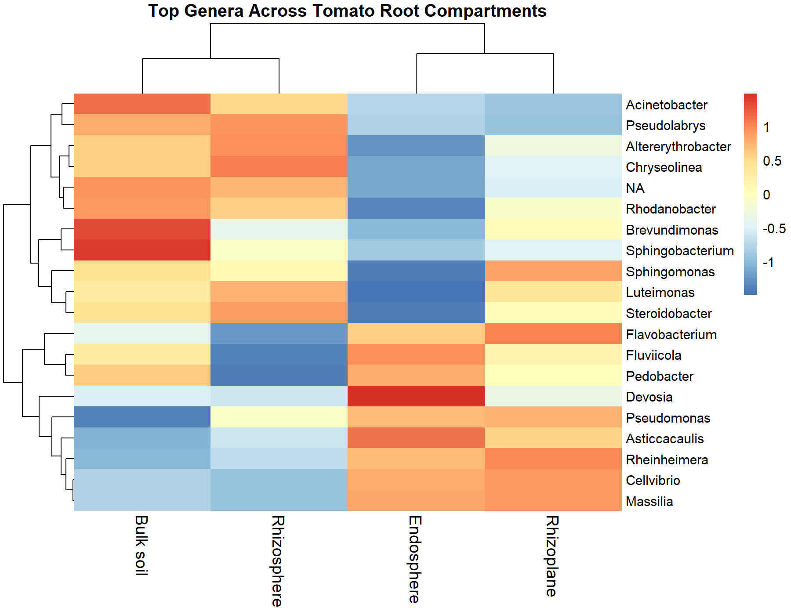
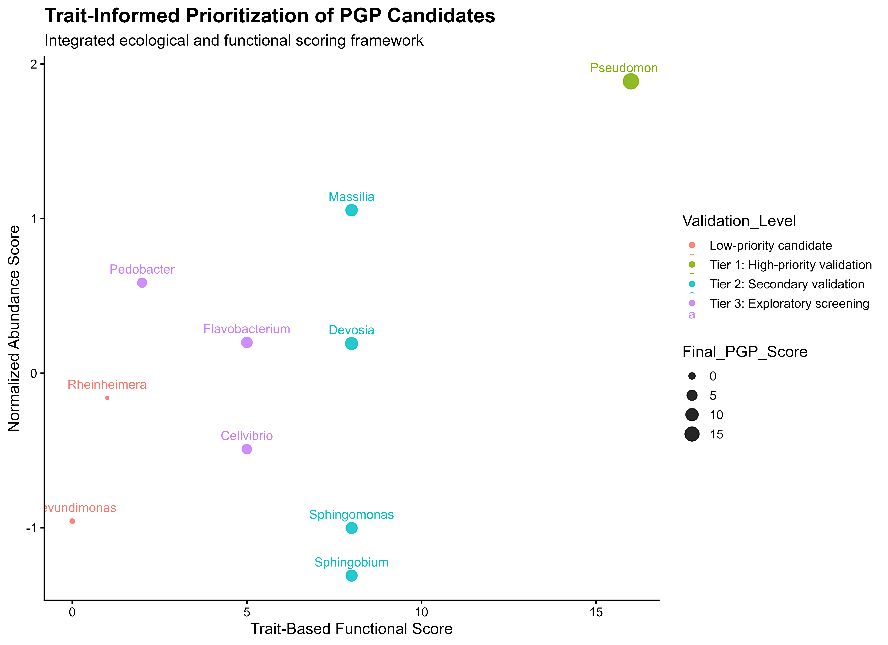

# Microbiome-Guided PGP-mBCA Discovery Pipeline

## Reproducible Computational Framework for Prioritizing Plant Growth-Promoting Microbial Biocontrol Candidates from Tomato Root-Associated Microbiomes

---

# Project Overview

This project presents a reproducible computational microbiome workflow for identifying and prioritizing candidate **plant growth-promoting microbial biocontrol agents (PGP-mBCAs)** from tomato root-associated bacterial communities using 16S rRNA amplicon sequencing data.

The pipeline integrates:

- microbiome ecology
- diversity analysis
- differential abundance testing
- trait-informed functional prioritization
- ecological prevalence modeling
- translational validation planning

to create a biologically interpretable framework for microbial candidate discovery.

Rather than claiming confirmed biocontrol activity, this project focuses on **evidence-based prioritization** of taxa that may warrant downstream:

- culturing
- functional screening
- genome sequencing
- greenhouse validation

The workflow was implemented entirely in **R** using reproducible modular scripts and open-source bioinformatics tools.

---

# Biological Rationale

Plant-associated microbiomes play major roles in:

- nutrient acquisition
- pathogen suppression
- induced systemic resistance (ISR)
- abiotic stress tolerance
- rhizosphere competition
- root colonization dynamics

Root-associated compartments such as the:

- rhizosphere
- rhizoplane
- endosphere

often select for distinct microbial assemblages enriched in taxa with plant-beneficial traits.

Many genera repeatedly reported in plant microbiome literature — including:

- *Pseudomonas*
- *Massilia*
- *Sphingomonas*
- *Flavobacterium*

are associated with functions such as:

- phosphate solubilization
- siderophore production
- nitrogen metabolism
- stress adaptation
- antibiosis
- biofilm formation

This project attempts to computationally prioritize such taxa using a combination of:

- ecological enrichment patterns
- prevalence across samples
- relative abundance
- literature-supported functional traits

to create a biologically grounded candidate-ranking framework.

---

# Workflow Overview

```text
Raw 16S Amplicon Data
        ↓
Quality Control & Filtering
        ↓
Phyloseq Object Construction
        ↓
Alpha Diversity Analysis
        ↓
Hellinger-Transformed PCA
        ↓
DESeq2 Differential Abundance
        ↓
Genus-Level Ecological Heatmap
        ↓
Literature-Informed Trait Mapping
        ↓
Weighted Candidate Prioritization
        ↓
Validation & Translational Framework
        ↓
Future WGS + antiSMASH Integration
```

---

# Methods

## 1. Data Import & Quality Control

Raw ASV abundance and metadata tables were imported into R and filtered to remove low-abundance taxa.

### Filtering Criteria

- ASVs with total abundance < 10 removed

### Core Packages

- `phyloseq`
- `tidyverse`

---

## 2. Microbiome Data Structure

A unified `phyloseq` object was constructed integrating:

- OTU/ASV table
- taxonomy table
- sample metadata

This enabled standardized downstream ecological analyses.

---

## 3. Alpha Diversity Analysis

Shannon diversity was calculated to compare microbial diversity across tomato root-associated compartments.

### Visualization

- boxplots
- jitter overlays

---

## 4. Beta Diversity & Ordination

Hellinger transformation was applied prior to PCA to reduce compositional bias from sparse count matrices.

Ordination was used to visualize:

- compartment-specific clustering
- ecological separation patterns

---

## 5. Differential Abundance Analysis

DESeq2 was used to identify genera enriched in rhizosphere samples relative to bulk soil.

### Key Methodological Considerations

- sparse microbiome-aware normalization (`poscounts`)
- negative binomial modeling
- adjusted p-value filtering

---

## 6. Genus-Level Heatmap

Relative abundances of dominant genera were aggregated and visualized using hierarchical clustering.

The heatmap was used to identify:

- ecological compartment preference
- dominant root-associated taxa
- enrichment trends

---

## 7. Trait-Informed Candidate Prioritization

Candidate genera were scored using a weighted framework integrating:

| Feature | Rationale |
|---|---|
| Trait Score | Literature-supported PGP functions |
| Mean Abundance | Ecological dominance |
| Prevalence | Consistency across samples |
| Validation Tier | Translational prioritization |

### Integrated Traits

- nitrogen fixation
- phosphate solubilization
- siderophore production
- stress tolerance
- biofilm formation
- root colonization
- biocontrol potential

---

# Key Figures

## PCA of Root-Associated Microbiomes

Demonstrates ecological structuring across tomato-associated compartments.

<p align="center">
  
</p>

---

## Shannon Diversity Across Compartments

Quantifies alpha diversity variation across belowground niches.

<p align="center">
  
</p>

---

## Differentially Abundant Genera

Highlights genera enriched in rhizosphere-associated communities.

<p align="center">
  
</p>

---

## Genus-Level Ecological Heatmap

Shows abundance patterns of dominant taxa across compartments.

<p align="center">
  
</p>

---

## Trait-Informed Candidate Prioritization

Integrated ecological and functional scoring framework.

<p align="center">
  
</p>

---

# Major Findings

## Ecological Structuring

Tomato-associated microbial communities showed clear compartment-dependent ecological organization.

---

## Candidate Enrichment

Several genera demonstrated enrichment in root-associated compartments, including:

- *Pseudomonas*
- *Devosia*
- *Massilia*
- *Sphingomonas*
- *Flavobacterium*

---

## Functional Prioritization

Trait-informed integration identified *Pseudomonas* as the highest-priority candidate due to combined:

- ecological prevalence
- abundance
- biocontrol-associated traits
- root colonization potential

---

## Translational Relevance

The project establishes a computational framework for:

- narrowing candidate lists
- prioritizing culturable taxa
- guiding downstream experimental validation

---

# Validation Framework

The project includes a proposed validation pipeline involving:

- selective culturing
- phosphate solubilization assays
- siderophore assays
- dual-culture pathogen inhibition
- greenhouse trials
- root colonization testing
- RT-qPCR defense marker analysis
- WGS characterization
- antiSMASH biosynthetic gene cluster mining

---

# Limitations

This project intentionally acknowledges several important limitations.

## 16S Resolution Limitations

16S amplicon sequencing cannot reliably resolve:

- strain-level diversity
- functional gene content
- biosynthetic capability

---

## Trait Inference

Functional traits were inferred from literature-supported genus associations and require direct experimental confirmation.

---

## Compositionality

Relative abundance data are compositional and do not directly represent absolute microbial biomass.

---

## Lack of Wet-Lab Validation

No direct greenhouse or pathogen challenge assays were performed in this computational phase.

---

# Future Work

Future extensions may include:

- isolate recovery
- shotgun metagenomics
- whole genome sequencing (WGS)
- antiSMASH biosynthetic analysis
- AMR/virulence screening
- synthetic microbial community construction
- greenhouse validation
- pathogen challenge assays
- longitudinal root colonization tracking

---

# Reproducibility

The workflow is fully reproducible using modular R scripts.

## Scripts

| Script | Purpose |
|---|---|
| `01_import_and_qc.R` | Data import and preprocessing |
| `02_diversity_analysis.R` | Alpha diversity and PCA |
| `03_differential_abundance.R` | DESeq2 analysis |
| `04_heatmap_analysis.R` | Genus-level heatmap |
| `05_candidate_scoring.R` | Trait-informed prioritization |
| `06_validation_framework.R` | Validation and limitations |
| `07_summary_visualizations.R` | Final project outputs |

---

# Software & Packages

- R
- phyloseq
- DESeq2
- vegan
- tidyverse
- ggplot2
- pheatmap

---

# Repository Structure

```text
scripts/                  → reproducible analysis scripts
results/github_figures/   → publication-style figures
docs/                     → project summaries
data/                     → processed lightweight data
```

---

# Scientific Positioning

This project is best interpreted as:

> A reproducible microbiome-guided computational framework for prioritizing candidate plant-associated microbial biocontrol agents using ecological abundance patterns and literature-informed functional traits.

It is **not** presented as definitive experimental confirmation of PGP-mBCA activity.

---

# Author

## Muhammad Laiq

Computational Biology / Bioinformatics  
Independent Research Project